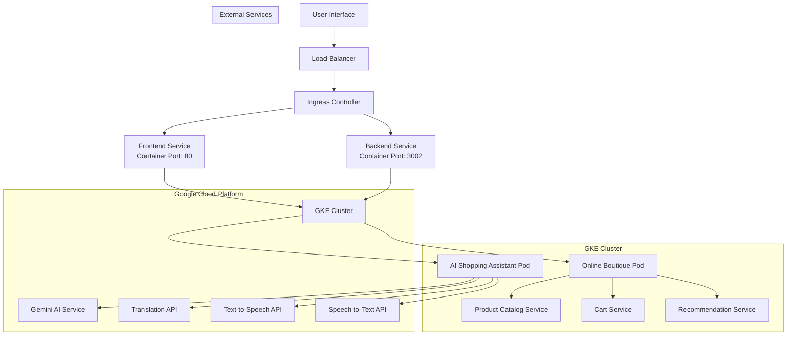

# Architecture Diagram for GKE Turns 10 Hackathon

## Updated Architecture with GKE Integration

## Component Details

### 1. User Interface Layer
- **Frontend Service**: React-based web interface running on port 80
- **Load Balancer**: External LoadBalancer service for public access
- **Ingress Controller**: GCE Ingress controller for path-based routing

### 2. Application Layer (GKE Cluster)
- **AI Shopping Assistant Pod**: Contains backend container with AI services
- **Online Boutique Pod**: Base microservices application (untouched)

### 3. AI Services (Google Cloud APIs)
- **Gemini AI Service**: Powers conversational shopping assistant
- **Translation API**: Real-time multilingual translation
- **Text-to-Speech API**: Voice response generation
- **Speech-to-Text API**: Voice input processing

### 4. Online Boutique Services
- **Product Catalog Service**: Product information management
- **Cart Service**: Shopping cart functionality
- **Recommendation Service**: Personalized product suggestions

## Data Flow

1. User accesses application through Load Balancer
2. Ingress routes requests to appropriate services
3. Frontend communicates with Backend service
4. Backend processes requests using AI services
5. AI services interact with Online Boutique APIs
6. Responses are translated and converted to speech if needed
7. Results are returned to user through Frontend service

## Scaling and High Availability

- **Horizontal Pod Autoscaler**: Automatically scales based on CPU usage
- **Multiple Replicas**: Ensures high availability
- **Resource Limits**: Prevents resource exhaustion
- **Health Checks**: Kubernetes liveness and readiness probes
